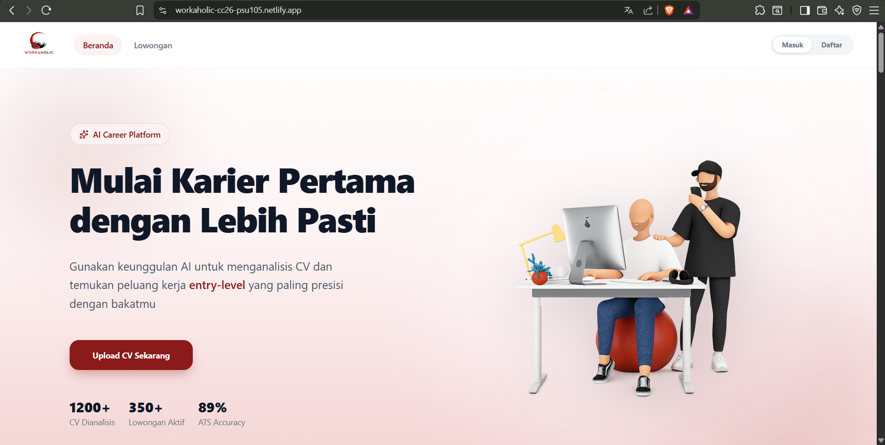
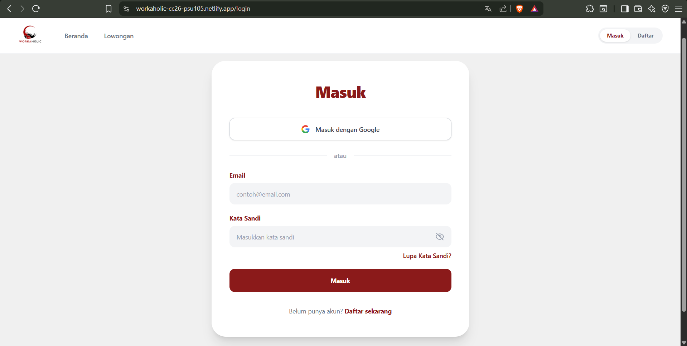
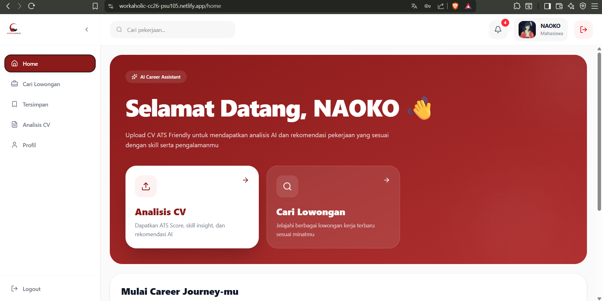
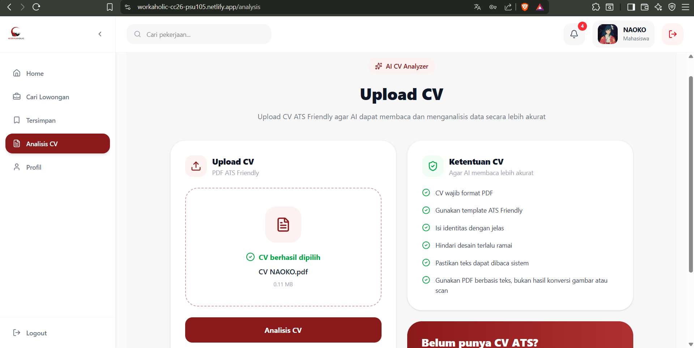
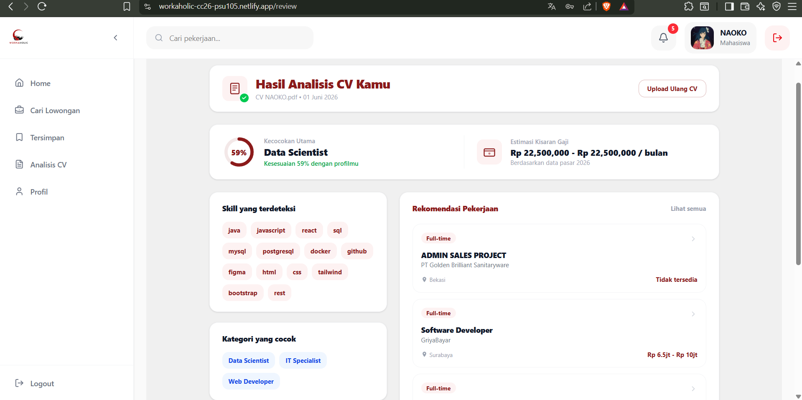
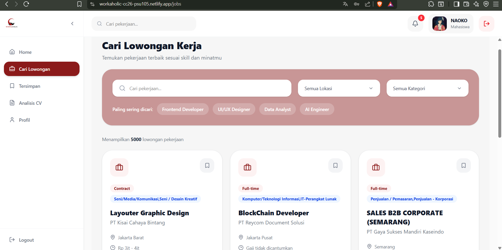
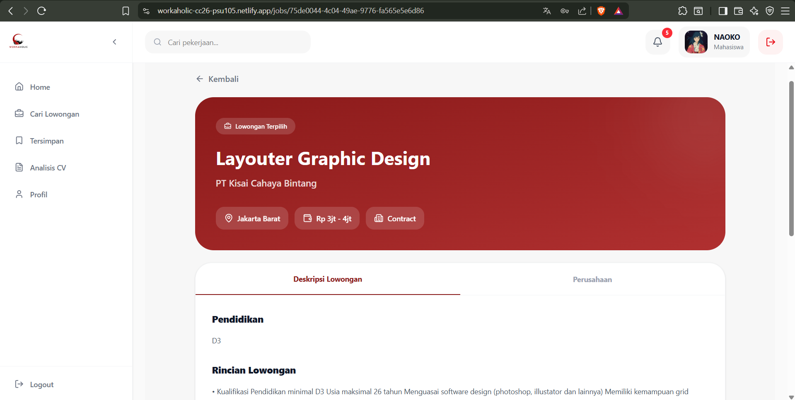
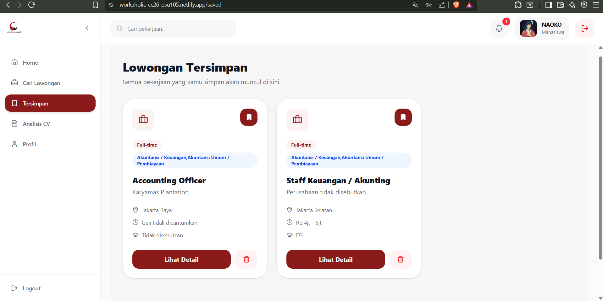
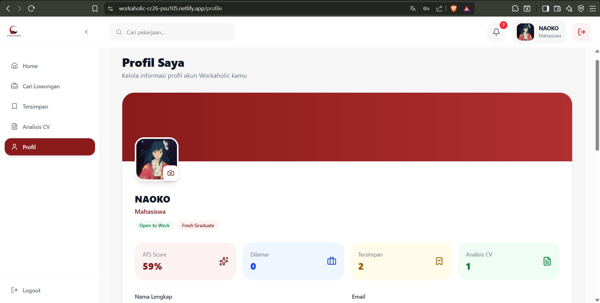

<div align="center">

<!-- Workaholic Logo -->


# 💼 WORKAHOLIC

### AI-Powered Job Recommendation Platform for Fresh Graduates

<p>
  <b>Upload your CV, get AI-based insights, discover suitable jobs, and start your career journey smarter.</b>
</p>

<br/>


<br/>


<br/>

[](https://git.io/typing-svg)

</div>

---

## ✨ About Workaholic

**Workaholic** is an AI-powered job recommendation web application designed to help **fresh graduates** and **entry-level job seekers** find suitable job opportunities based on their CV.

This platform allows users to upload their CV, receive AI-based CV analysis, explore job recommendations, search job vacancies, save preferred jobs, and manage their profile in one place.

Workaholic was developed as part of the **Coding Camp 2026 - Full Stack Web Developer Learning Path** capstone project.

> "Helping fresh graduates discover better career opportunities through technology and AI."

---

## 📌 Background

Many fresh graduates face difficulties when looking for their first job. Some of them are unsure whether their skills, experiences, and CV are suitable for available job vacancies. On the other hand, job seekers often need to browse many job platforms manually, which can be time-consuming and confusing.

Workaholic was created to help solve this problem by combining **web development**, **backend services**, **database management**, and **AI-based recommendation**. The system analyzes the user's CV and provides job recommendations that are more relevant to the user's background.

---

## 🎯 Project Goals

The main goals of Workaholic are:

* To help fresh graduates find job opportunities that match their CV.
* To provide AI-based CV analysis and improvement suggestions.
* To simplify the job search process through search and filtering features.
* To provide a saved jobs feature so users can keep track of interesting vacancies.
* To build a complete web application using frontend, backend, database, and AI service integration.

---

## 🚀 Live Demo

| Platform    | Link                                                     |
| ----------- | ---------------------------------------------------------|
| Frontend    | https://workaholic-cc26-psu105.netlify.app/              |
| Backend API | https://workaholic-cc26-psu105-production.up.railway.app |
| AI Service  | https://syiifac-workaholic-api.hf.space                  |

---

## 🖼️ Screenshots

### 1. Landing Page


### 2. Login Page


### 3. Dashboard


### 4. Upload CV


### 5. CV Review


### 6. Jobs Page


### 7. Job Detail


### 8. Saved Jobs


### 9. Profile Page


---

## 🧩 Main Features

| Feature               | Description                                                  |
| --------------------- | ------------------------------------------------------------ |
| 🔐 Authentication     | Register, login, logout, forgot password, and reset password |
| 👤 User Profile       | View and update user profile information                     |
| 🖼️ Avatar Upload     | Upload user profile picture using Supabase Storage           |
| 📄 CV Upload          | Upload CV file in PDF format                                 |
| 🤖 AI CV Analysis     | Analyze CV and generate recommendation results               |
| 💼 Job Recommendation | Display jobs that match the user's CV analysis               |
| 🔎 Job Search         | Search and filter available job vacancies                    |
| 📌 Saved Jobs         | Save and remove preferred jobs                               |
| 🕘 CV History         | View previous CV analysis history                            |
| 📊 Home Statistics    | Display total jobs, categories, saved jobs, and latest jobs  |

---

## 🛠️ Tech Stack

<div align="center">

| Frontend     | Backend    | Database            | AI Service              | Deployment       |
| ------------ | ---------- | ------------------- | ----------------------- | ---------------- |
| React        | Node.js    | Supabase PostgreSQL | Python Model API        | Netlify          |
| Vite         | Express.js | Supabase Auth       | Hugging Face Space      | Railway          |
| Tailwind CSS | Multer     | Supabase Storage    | CV Recommendation Model | Supabase         |
| Axios        | CORS       | PostgreSQL          | Job Classifier Model    |                  |

</div>

---

## 🗂️ Project Structure

```bash
workaholic-cc26-psu105/
│
├── backend/
│   ├── controllers/
│   ├── middlewares/
│   ├── routes/
│   ├── services/
│   ├── utils/
│   ├── app.js
│   ├── server.js
│   └── package.json
│
├── frontend/
│   ├── public/
│   ├── src/
│   │   ├── assets/
│   │   ├── components/
│   │   ├── pages/
│   │   ├── services/
│   │   ├── utils/
│   │   ├── App.jsx
│   │   └── main.jsx
│   └── package.json
│
├── ml/
│   └── AI model and service files
│
├── data/
│   └── Dataset files
│
├── docs/
│   └── Documentation and screenshots
│
└── README.md
```

---

## 🔄 Application Flow

```txt
User Register / Login
        ↓
User accesses the dashboard
        ↓
User uploads CV in PDF format
        ↓
Backend receives the CV file
        ↓
Backend sends CV to AI service
        ↓
AI service analyzes the CV
        ↓
AI returns CV analysis and job recommendations
        ↓
User views CV review and recommended jobs
        ↓
User can search, view, save, or remove jobs
```

---

## 🔐 Authentication Flow

Workaholic uses **Supabase Auth** for user authentication.

The authentication features include:

* User registration
* User login
* User logout
* Forgot password
* Reset password
* Token-based protected routes

After a user logs in, the frontend stores the access token and sends it to the backend using the Authorization header.

```http
Authorization: Bearer <access_token>
```

The backend verifies the token before allowing access to protected endpoints such as profile, saved jobs, CV analysis, and CV history.

---

## 🗃️ Database

This project uses **Supabase PostgreSQL** as the main database.

Main tables used in the project:

| Table         | Description                                |
| ------------- | ------------------------------------------ |
| `jobs`        | Stores job vacancy data                    |
| `saved_jobs`  | Stores jobs saved by users                 |
| `cv_analysis` | Stores CV analysis results                 |
| `cv_history`  | Stores user CV analysis history            |
| `profiles`    | Stores additional user profile information |

Supabase Auth is used to manage user accounts, while additional profile data is stored separately in the profile-related table.

---

## 🤖 AI Service Integration

The backend communicates with an external AI service deployed on **Hugging Face Space**.

Main AI service endpoints:

| Method | Endpoint        | Description             |
| ------ | --------------- | ----------------------- |
| GET    | `/health`       | Check AI service status |
| POST   | `/predict`      | Analyze uploaded CV PDF |
| POST   | `/predict-text` | Analyze CV text input   |

The AI service returns:

* CV analysis result
* Recommended job category
* Skills extracted from the CV
* Job recommendation data
* CV improvement suggestions
* ATS score

---

## 📡 API Documentation

### Health Check

| Method | Endpoint      | Description                           |
| ------ | ------------- | ------------------------------------- |
| GET    | `/api/health` | Check backend and database connection |

---

### Authentication

| Method | Endpoint                    | Description                 |
| ------ | --------------------------- | --------------------------- |
| POST   | `/api/auth/register`        | Register a new user         |
| POST   | `/api/auth/login`           | Login user                  |
| POST   | `/api/auth/forgot-password` | Send password reset request |
| POST   | `/api/auth/reset-password`  | Reset user password         |

---

### User Profile

| Method | Endpoint              | Description                   |
| ------ | --------------------- | ----------------------------- |
| GET    | `/api/profile`        | Get logged-in user profile    |
| PUT    | `/api/profile`        | Update logged-in user profile |
| POST   | `/api/profile/avatar` | Upload user avatar            |

---

### Jobs

| Method | Endpoint        | Description                                   |
| ------ | --------------- | --------------------------------------------- |
| GET    | `/api/jobs`     | Get job vacancies with pagination and filters |
| GET    | `/api/jobs/:id` | Get job detail by ID                          |

Example query for job search:

```http
GET /api/jobs?q=developer&location=Jakarta&page=1&limit=10
```

Supported filters may include:

* `q`
* `location`
* `category`
* `employment`
* `salaryAvailable`
* `page`
* `limit`

---

### Saved Jobs

| Method | Endpoint              | Description        |
| ------ | --------------------- | ------------------ |
| GET    | `/api/saved-jobs`     | Get saved jobs     |
| POST   | `/api/saved-jobs`     | Save a job         |
| DELETE | `/api/saved-jobs/:id` | Remove a saved job |

---

### CV Analysis

| Method | Endpoint              | Description                |
| ------ | --------------------- | -------------------------- |
| POST   | `/api/cv/analyze`     | Upload and analyze CV      |
| GET    | `/api/cv/history`     | Get CV analysis history    |
| DELETE | `/api/cv/history/:id` | Delete CV analysis history |

CV upload requirement:

```txt
File type: PDF
Field name: file
Maximum size: 2MB
```

Example request:

```http
POST /api/cv/analyze
Content-Type: multipart/form-data
Authorization: Bearer <access_token>
```

Form-data:

```txt
file: your-cv.pdf
```

---

### Home

| Method | Endpoint          | Description              |
| ------ | ----------------- | ------------------------ |
| GET    | `/api/home/stats` | Get dashboard statistics |

The home statistics endpoint returns:

* Total jobs
* Total job categories
* Total saved jobs
* Latest jobs

---

## ⚙️ Environment Variables

### Backend `.env`

Create a `.env` file inside the `backend` folder.

```env
PORT=5000

SUPABASE_URL=your_supabase_url
SUPABASE_ANON_KEY=your_supabase_anon_key
SUPABASE_SERVICE_ROLE_KEY=your_supabase_service_role_key

AI_BASE_URL=https://syiifac-workaholic-api.hf.space
AI_PREDICT_ENDPOINT=/predict
AI_HEALTH_ENDPOINT=/health

USE_AI_MOCK=false
```

---

### Frontend `.env`

Create a `.env` file inside the `frontend` folder.

```env
VITE_API_BASE_URL=your_backend_url/api
VITE_SUPABASE_URL=your_supabase_url
VITE_SUPABASE_ANON_KEY=your_supabase_anon_key
```

---

## 🧪 Installation and Setup

### 1. Clone Repository

```bash
git clone https://github.com/your-username/workaholic-cc26-psu105.git
cd workaholic-cc26-psu105
```

---

### 2. Setup Backend

Go to the backend folder:

```bash
cd backend
```

Install dependencies:

```bash
npm install
```

Create and configure the `.env` file.

Run the backend in development mode:

```bash
npm run dev
```

Backend will run on:

```txt
http://localhost:5000
```

---

### 3. Setup Frontend

Go to the frontend folder:

```bash
cd frontend
```

Install dependencies:

```bash
npm install
```

Create and configure the `.env` file.

Run the frontend in development mode:

```bash
npm run dev
```

Frontend will run on:

```txt
http://localhost:5173
```

---

## 🧾 Available Scripts

### Backend

| Command       | Description                    |
| ------------- | ------------------------------ |
| `npm run dev` | Run backend using nodemon      |
| `npm start`   | Run backend in production mode |

---

### Frontend

| Command           | Description                      |
| ----------------- | -------------------------------- |
| `npm run dev`     | Run frontend development server  |
| `npm run build`   | Build frontend for production    |
| `npm run preview` | Preview production build locally |
| `npm run lint`    | Run frontend linting             |

---

## 👥 Team

This project was developed by the **Workaholic Capstone Team**.

| Role                      | Responsibility                                                                        |
| ------------------------- | ------------------------------------------------------------------------------------- |
| Frontend Developer        | Build user interface and integrate frontend with backend API                          |
| Backend Developer         | Build REST API, authentication flow, database integration, and AI service integration |
| Machine Learning Engineer | Build and deploy AI model service                                                     |
| Data Scientist            | Prepare, clean, and process job vacancy dataset                                       |

---

## 💻 Backend Developer Contribution

The backend development focused on building the REST API and connecting the frontend, database, authentication system, and AI service.

Main backend contributions include:

* Designed and developed Express.js backend structure.
* Integrated backend with Supabase PostgreSQL.
* Implemented authentication flow using Supabase Auth.
* Created protected routes using token verification.
* Created user profile endpoints.
* Created avatar upload feature using Supabase Storage.
* Created job vacancy endpoints with search, filter, and pagination.
* Created job detail endpoint.
* Created saved jobs endpoints.
* Created CV analysis endpoint using file upload.
* Integrated backend with external AI service.
* Created CV history feature.
* Created home dashboard statistics endpoint.
* Connected deployed backend with frontend.
* Fixed integration issues related to authentication, profile, dashboard, and database.

---

## 📊 Project Status

<div align="center">

| Feature                | Status      |
| ---------------------- | ----------- |
| Authentication         | ✅ Completed |
| User Profile           | ✅ Completed |
| Avatar Upload          | ✅ Completed |
| Job List               | ✅ Completed |
| Job Detail             | ✅ Completed |
| Saved Jobs             | ✅ Completed |
| CV Upload              | ✅ Completed |
| CV Analysis            | ✅ Completed |
| CV History             | ✅ Completed |
| Home Statistics        | ✅ Completed |
| Backend Deployment     | ✅ Completed |
| Frontend Integration   | ✅ Completed |
| AI Service Integration | ✅ Completed |

</div>

---

## 🧠 Challenges and Solutions

During development, several challenges were encountered and solved:

| Challenge                               | Solution                                                             |
| --------------------------------------- | -------------------------------------------------------------------- |
| Frontend still displayed dummy data     | Updated frontend integration to use backend API data                 |
| Profile data did not update correctly   | Fixed profile endpoint and synchronized data with authenticated user |
| Dashboard displayed different user name | Adjusted user data source and profile response                       |
| Supabase table relation issue           | Updated database query to use the correct profile-related table      |
| AI service integration error            | Adjusted AI base URL and endpoint configuration                      |
| Deployment environment issue            | Updated environment variables for production deployment              |

---

## 🔮 Future Improvements

Some features that can be improved in the future:

* Google OAuth login
* More advanced job recommendation ranking
* More detailed CV parsing
* Admin dashboard for managing job data
* Job application tracking
* Notification system
* More detailed analytics dashboard
* Improved AI explanation for recommendations
* Better recommendation based on user preferences
* Real-time job data updates

---

## 📚 Acknowledgement

This project was developed as part of **Coding Camp 2026 - Full Stack Web Developer Learning Path**.

Special thanks to mentors, instructors, and all team members who contributed to the development of Workaholic.

---

## 📄 License

This project is developed for educational and capstone project purposes.

---

<div align="center">

### Made with ❤️ by W Team

<p>
  <b>Workaholic — Helping fresh graduates start their career journey smarter.</b>
</p>

</div>
